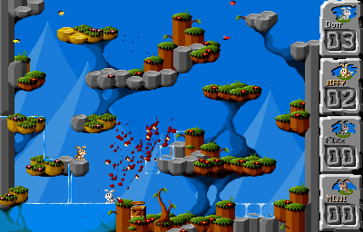

Overview
=====
This is my Switch and Vita port of the classic DOS game Jump'n'Bump by Brainchild Design, based on the SDL2 port by @felixhaedicke.

Jump'n'Bump is a simple but addictive multiplayer game. The goal is to stomp as many other rabbits as possible to win the game.



Thanks
======
Thanks to my supporters on Patreon: Andyways, CountDuckula, Greg Gibson, Jesse Harlin, Özgür Karter, Matthew Machnee, and RadicalR.

Thanks to the many developers of the game, such as Mattias Brynervall, Andreas Brynervall, Anders Nilsson, and many more.

Thanks to Felix Haedicke for porting the game to SDL2 and Cmake.

Installation Instructions
=====
Switch:
- Extract the contents of jumpnbump_switch.zip into the `switch` folder on your SD card, so that you have a folder `switch/jumpnbump` with `jumpnbump.nro` inside.

Vita:
- install the .vpk file using Vitashell

Switch-exclusive features
=====
- Split Joycon support: To toggle between split and combined Joycons, press R or L on joycon 1.

Controls (controls updated with version 1.08)
=====
Left analog stick / Dpad = Move the character  
B/Y/A/X = Jump
Plus/Minus/Select/Start = ESC (restart game/advance through statistic screens)
R (on controller 1) = toggle aspect ratio between original (default), 4:3, and 16:9
L (on controller 1) = toggle split Joycon mode on/off (Switch only)

Build Instructions
=====
Switch:
````
cmake -DBUILD_NX=ON -DCMAKE_RELEASE_TYPE=Release
make jumpnbump_switch.zip -j12
````

Vita:
````
cmake -DBUILD_PSP2=ON -DCMAKE_RELEASE_TYPE=Release
make jumpnbump.vpk -j12
````

Changelog
=====
v1.00

- First release on Switch and Vita